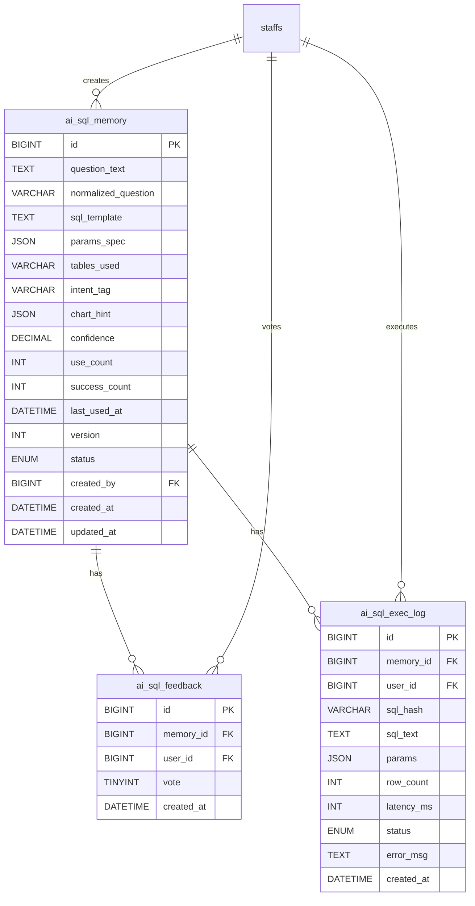

# AI Agent 后端架构设计（Java + Python）

## 1. 目标与边界

- 输入：自然语言问题（例如“近三个月各产品销售额趋势”）
- 输出：
  - 第一步：生成 SQL（不在 Python 端执行）
  - 第二步：由 Java 安全执行 SQL 并返回结果
  - 第三步：Python 根据结果生成图表图片，Java 返回可访问 URL
- 第一版聚焦：
  - 只支持查询类 SQL（`SELECT` / `WITH`）
  - 不支持写操作（`INSERT`/`UPDATE`/`DELETE`/DDL）

---

## 2. 总体架构

```mermaid
flowchart LR
    FE[Frontend]
    J[SpringBootBackend]
    P[PythonAIService]
    DB[(MySQL)]
    FS[(ChartStorage)]

    FE -->|POST /api/ai/generate-sql| J
    J -->|POST /generate-sql| P
    P -->|sql + chartHint| J
    J -->|sql + hints| FE

    FE -->|POST /api/ai/execute-sql| J
    J -->|EXPLAIN + SELECT LIMIT| DB
    J -->|POST /generate-chart| P
    P -->|write png| FS
    P -->|chartId/fileName| J
    J -->|chartUrl + rows| FE

    FE -->|GET /api/ai/chart/{chartId}| J
    J -->|read file| FS
```

---

## 3. 服务职责划分

## Java（主后端，权威入口）
- 对外统一入口：`/api/ai/*`
- 负责鉴权、权限、审计、SQL 安全校验、`EXPLAIN` 校验、真正执行 SQL
- 负责拼装并返回统一响应格式：`{ code, message, data }`
- 负责图表 URL 统一对外暴露（避免前端直接访问 Python 文件路径）

## Python（AI + 图表服务）
- 只负责：
  - 将自然语言转为 SQL 与图表建议（`chartHint`）
  - 将 Java 查询结果绘制为 png（`matplotlib`）
- 不直接执行数据库查询
- 框架建议：`FastAPI`
- Agent 编排建议：
  - 优先 `LangGraph`（可控）
  - 若想轻依赖，可先用“手写最小状态机 + 结构化 JSON 输出”

---

## 4. 核心接口设计

## 4.1 Java 对前端

### `POST /api/ai/generate-sql`
- 请求：
```json
{
  "question": "近三个月各产品销售额趋势"
}
```
- 响应（data）：
```json
{
  "sql": "SELECT ...",
  "reason": "按月份聚合并按产品分组",
  "chartHint": {
    "type": "line",
    "x": "month",
    "y": "total_sales",
    "series": "product_name"
  },
  "confidence": 0.82,
  "warnings": []
}
```

### `POST /api/ai/execute-sql`
- 请求：
```json
{
  "sql": "SELECT ...",
  "question": "近三个月各产品销售额趋势",
  "chartHint": {
    "type": "line",
    "x": "month",
    "y": "total_sales",
    "series": "product_name"
  }
}
```
- 响应（data）：
```json
{
  "sql": "SELECT ...",
  "columns": ["month", "product_name", "total_sales"],
  "rows": [
    ["2026-01", "A产品", 1000.0],
    ["2026-02", "A产品", 1200.0]
  ],
  "chartUrl": "/api/ai/chart/9f3e8c9a"
}
```

### `GET /api/ai/chart/{chartId}`
- 返回 `image/png`

## 4.2 Java 对 Python

### `POST /generate-sql`
- 入参：`{ question }`
- 出参：`{ sql, reason, chartHint, confidence, warnings }`

### `POST /generate-chart`
- 入参：`{ question, columns, rows, chartHint }`
- 出参：`{ chartId, fileName }`

---

## 5. SQL 安全策略（必须项）

- 仅允许 `SELECT` / `WITH` 开头
- 拒绝分号 `;`（防止多语句）
- 拒绝写操作和敏感关键词（如 `insert`, `update`, `delete`, `drop`, `alter`, `truncate`, `grant`, `revoke`）
- 拒绝敏感系统库（如 `information_schema`, `mysql`, `performance_schema`, `sys`）
- 可选：表白名单（仅允许业务表）
- 强制最大返回行数（如 `LIMIT 100`）
- 设置执行超时（防止慢查询拖垮系统）
- 执行前做 `EXPLAIN` 校验，不通过直接返回结构化错误

---

## 6. 权限与审计

- `POST /api/ai/execute-sql` 建议限制为管理员或指定角色
- 记录审计日志：
  - 调用人、时间、SQL 摘要、耗时、返回行数、是否通过安全校验
- 错误返回结构化信息：
```json
{
  "code": 400,
  "message": "SQL 安全校验未通过",
  "data": {
    "failedRule": "contains_forbidden_keyword",
    "suggestion": "请只使用 SELECT 查询业务表"
  }
}
```

---

## 7. 图表策略（matplotlib）

- Python 根据 `chartHint` 自动选图：
  - 折线图：时间序列趋势
  - 柱状图：分类对比
  - 饼图：占比（分类数量较少时）
- 图片文件写入共享目录（如 `backend/charts/`）
- Java 通过 `chartId -> fileName` 映射读取并返回二进制图片
- 前端只使用 `chartUrl` 渲染，不感知磁盘路径

---

## 8. 目录建议

- 根目录新增：`aiagent/`（Python 服务）
- Java 新增建议：
  - `backend/src/main/java/com/database/controller/AiAgentController.java`
  - `backend/src/main/java/com/database/controller/AiChartController.java`
  - `backend/src/main/java/com/database/service/AiAgentService.java`
  - `backend/src/main/java/com/database/service/SqlSecurityService.java`
  - `backend/src/main/java/com/database/dto/...`（AI 请求/响应 DTO）
- 配置新增：
  - `backend/src/main/resources/application.yaml` 增加 `aiagent.baseUrl`、`chart.dir`、`ai.sql.maxRows`、`ai.sql.timeoutMs`

---

## 9. 推荐实施顺序

1. 先做 `POST /api/ai/generate-sql`（打通 Java -> Python）
2. 再做 Java 安全执行 `POST /api/ai/execute-sql`
3. 最后接入 `POST /generate-chart` + `GET /api/ai/chart/{chartId}`
4. 增加权限、审计、失败回退提示

---

## 10. 最小可用验收标准（MVP）

- 能从自然语言稳定生成可读 SQL
- 非法 SQL 会被明确拦截并给出修正建议
- 合法 SQL 可返回 `columns + rows`
- 能返回可访问的图表 URL 并在前端展示图片

---

## 11. V3 架构决策

### 11.1 部署形态：模块化单体

- Java 对外统一 API（`/api/ai/*`），承担鉴权、安全校验、执行、审计。
- Python 仅内网被 Java 调用（配置化 `aiagent.baseUrl`），不对外暴露端口。
- 当前不引入服务发现/注册中心/API 网关。
- 接口契约固定化后，未来可平滑拆分为独立微服务。

### 11.2 LLM 数据隔离策略

- **Phase1（当前）**：LLM 不接触原始查询结果。
  - LLM 只能看到 `db.sql` 中的 schema/元数据（表名、列名、类型、注释）。
  - LLM 输出 SQL 模板与图表建议（`chartHint`），不参与结果解读。
  - 图表由后端根据 `chartHint` 规则 + matplotlib 直接生成，无需 LLM 理解数据。
- **Phase2（未来可选）**：灰度允许 LLM 接触聚合/脱敏后的小样本结果。
  - 前提：白名单字段、行数阈值、敏感字段脱敏、审计日志。

### 11.3 鉴权与权限策略

- 所有 `/api/ai/*` 接口必须携带 JWT Token（复用现有 `AuthInterceptor`）。
- `POST /api/ai/generate-sql`：普通登录用户可用。
- `POST /api/ai/execute-sql`：限管理员或分析角色（在 `WebConfig` 中配置路径权限或在 Service 层校验角色）。
- `POST /api/ai/feedback`：普通登录用户可用（Phase2）。
- Python 服务不做鉴权（仅内网，Java 已鉴权后转发）。

### 11.4 参数化 SQL 模板设计

- LLM 生成的 SQL 应包含占位符参数（如 `{top_n}`、`{quarter}`、`{category}`），而非硬编码值。
- 参数规格（`paramsSpec`）与 SQL 模板一起返回，前端据此渲染参数表单。
- 用户可修改参数后执行，同一模板可复用于不同查询条件。
- 接口契约：

**`POST /generate-sql`（Python 端）**
```json
{
  "question": "查询本季度销售额前10的产品"
}
```
响应：
```json
{
  "sqlTemplate": "SELECT p.product_name, SUM(soi.subtotal) AS total_sales FROM sales_order_items soi JOIN products p ON soi.product_id = p.id JOIN sales_orders so ON soi.order_id = so.id WHERE so.order_date >= {start_date} AND so.order_date < {end_date} GROUP BY p.product_name ORDER BY total_sales DESC LIMIT {top_n}",
  "paramsSpec": [
    { "name": "start_date", "type": "date", "default": "2026-01-01", "required": true, "label": "开始日期" },
    { "name": "end_date", "type": "date", "default": "2026-04-01", "required": true, "label": "结束日期" },
    { "name": "top_n", "type": "int", "default": 10, "required": false, "label": "前N名" }
  ],
  "reason": "按产品分组聚合销售额并取前N",
  "chartHint": { "type": "bar", "x": "product_name", "y": "total_sales" },
  "confidence": 0.85,
  "warnings": []
}
```

**`POST /api/ai/execute-sql`（Java 端）**
```json
{
  "sqlTemplate": "SELECT ... LIMIT {top_n}",
  "params": { "start_date": "2026-01-01", "end_date": "2026-04-01", "top_n": 10 },
  "chartHint": { "type": "bar", "x": "product_name", "y": "total_sales" }
}
```
响应：
```json
{
  "columns": ["product_name", "total_sales"],
  "rows": [["A产品", 50000.0], ["B产品", 42000.0]],
  "chartUrl": "/api/ai/chart/a3f8c1d2",
  "sqlTemplate": "SELECT ... LIMIT {top_n}",
  "params": { "start_date": "2026-01-01", "end_date": "2026-04-01", "top_n": 10 }
}
```

---

## 12. 图表 Utils/Skills 设计

### 12.1 自动选图策略

| 数据特征 | 推荐图表 | 说明 |
|---|---|---|
| 二值（名称+数值）且分类 <= 8 | 饼图 | 占比分析 |
| 二值（名称+数值）且分类 > 8 | 柱状图 | 分类对比 |
| 含时间列 + 数值列 | 折线图 | 趋势分析 |
| 含时间列 + 数值列 + 分组列 | 多系列折线图 | 分组趋势 |
| 其他 | 柱状图（默认） | 通用对比 |

### 12.2 函数清单（`aiagent/charts/`）

- `build_bar_chart(title, labels, values, output_path)` — 柱状图
- `build_pie_chart(title, labels, values, output_path)` — 饼图
- `build_line_chart(title, x_data, y_series, series_names, output_path)` — 折线图
- `select_chart_type(columns, rows, chart_hint)` — 根据数据特征与 chartHint 自动选图
- `render_chart(question, columns, rows, chart_hint, output_dir)` — 统一入口，自动选图 + 渲染 + 返回文件名

---

## 13. 前端自然语言查询页设计

### 13.1 页面结构

```
┌──────────────────────────────────────────┐
│ 自然语言输入框（textarea）              │
│ [生成 SQL] 按钮                          │
├──────────────────────────────────────────┤
│ SQL 模板展示区（代码高亮/只读）          │
│ 参数表单区（根据 paramsSpec 动态渲染）   │
│ [执行查询] 按钮                          │
├──────────────────────────────────────────┤
│ 结果表格（columns + rows）               │
│ 图表展示区（img src=chartUrl）           │
│ [点赞] [点踩] 按钮（Phase2）             │
└──────────────────────────────────────────┘
```

### 13.2 交互流程

1. 用户输入自然语言问题，点击"生成 SQL"。
2. 前端调用 `POST /api/ai/generate-sql`，展示 `sqlTemplate` + `paramsSpec` 渲染参数表单。
3. 用户可修改参数默认值，点击"执行查询"。
4. 前端调用 `POST /api/ai/execute-sql`，展示结果表格 + 图表。
5. Phase2：用户可对结果点赞/点踩。

### 13.3 技术选型

- 页面路由：`/ai-query`（在 `frontend/src/router/` 中新增）
- 组件：`AiQueryView.vue`（在 `frontend/src/views/` 中新增）
- 参数表单：根据 `paramsSpec` 中的 `type` 动态渲染（date picker、number input、text input）
- SQL 展示：使用 `<pre>` 或代码高亮组件
- 图表：`` 直接展示

---

## 14. Phase2 路线图：SQL-RAG 记忆与反馈

### 14.1 记忆数据模型

**`ai_sql_memory`**
| 字段 | 类型 | 说明 |
|---|---|---|
| id | BIGINT PK | 主键 |
| question_text | TEXT | 原始自然语言问题 |
| normalized_question | VARCHAR(500) | 归一化问题（去停用词、小写） |
| sql_template | TEXT | 参数化 SQL 模板 |
| params_spec | JSON | 参数规格 |
| tables_used | VARCHAR(500) | 涉及的表名（逗号分隔） |
| intent_tag | VARCHAR(100) | 意图标签（排名/趋势/占比/汇总） |
| chart_hint | JSON | 图表建议 |
| created_by | BIGINT | 创建人 |
| created_at | DATETIME | 创建时间 |
| last_used_at | DATETIME | 最近使用时间 |
| use_count | INT | 使用次数 |
| success_count | INT | 执行成功次数 |
| version | INT | 模板版本号 |
| status | ENUM('draft','published','archived') | 状态 |

**`ai_sql_feedback`**
| 字段 | 类型 | 说明 |
|---|---|---|
| id | BIGINT PK | 主键 |
| memory_id | BIGINT FK | 关联 ai_sql_memory |
| user_id | BIGINT | 反馈用户 |
| vote | TINYINT | +1（赞）/ -1（踩） |
| created_at | DATETIME | 反馈时间 |

**`ai_sql_exec_log`**
| 字段 | 类型 | 说明 |
|---|---|---|
| id | BIGINT PK | 主键 |
| memory_id | BIGINT FK | 关联 ai_sql_memory（可为空，首次生成时无记忆） |
| user_id | BIGINT | 执行人 |
| sql_hash | VARCHAR(64) | SQL 文本 SHA256 |
| params | JSON | 实际执行参数 |
| row_count | INT | 返回行数 |
| latency_ms | INT | 耗时 |
| status | ENUM('success','explain_fail','security_reject','timeout','error') | 执行状态 |
| error_msg | TEXT | 错误信息（可为空） |
| created_at | DATETIME | 执行时间 |

### 14.2 检索排序策略

```
score = textSimilarity * 0.40
      + intentMatch   * 0.20
      + tableOverlap  * 0.15
      + feedbackScore  * 0.15
      + recencyScore   * 0.10
```

- `textSimilarity`：归一化问题的关键词 Jaccard 相似度（Phase2 可升级为向量余弦）
- `intentMatch`：意图标签完全匹配为 1.0，否则 0.0
- `tableOverlap`：涉及表的 Jaccard 重叠度
- `feedbackScore`：`(likes - dislikes) / max(1, totalVotes)`，加时间衰减
- `recencyScore`：`1 / (1 + daysSinceLastUsed / 30)`

命中阈值：
- `score >= 0.75`：优先复用（可直接返回或轻微改写）
- `0.50 <= score < 0.75`：作为 LLM 上下文参考
- `score < 0.50`：从头生成

### 14.3 反馈接口

**`POST /api/ai/feedback`**
```json
{
  "memoryId": 42,
  "vote": 1
}
```
响应：`{ "code": 200, "message": "反馈已记录" }`

### 14.4 版本管理与回滚

- 每次 SQL 模板被改写时，`version` 自增，旧版本保留在 `ai_sql_memory` 历史行或独立版本表中。
- 提供 `POST /api/ai/sql-memory/{id}/rollback?version=N` 回滚到指定版本。
- 已发布（`published`）模板才参与检索排序；`draft` 和 `archived` 不参与。

### 14.5 未来微服务拆分触发条件

满足以下任一条件时，评估拆分为独立 `sql-memory-service`：
- 记忆表数据量超过 100 万条
- 检索 p95 延迟超过 200ms
- 团队需要独立发布节奏
- 需要引入向量数据库（如 Milvus/Qdrant）做语义检索

---

## 15. AI 模块数据库设计

> 建表脚本：`scripts/ai_tables.sql`
> 执行方式：`mysql -u root -p dbproject < scripts/ai_tables.sql`

### 15.1 表关系总览



### 15.2 各表用途

| 表名 | 阶段 | 用途 |
|---|---|---|
| `ai_sql_memory` | Phase2 | 存储 LLM 生成的参数化 SQL 模板，供历史检索复用与版本管理 |
| `ai_sql_feedback` | Phase2 | 记录用户对 SQL 模板的点赞/点踩，影响检索排序权重 |
| `ai_sql_exec_log` | Phase1 起 | 每次 AI 执行 SQL 的审计日志（执行人、SQL、耗时、状态、错误信息） |

### 15.3 字段设计要点

**ai_sql_memory**
- `normalized_question`：对用户问题做小写化、去停用词处理后存储，用于检索时的关键词匹配。前缀索引 200 字符。
- `params_spec`：JSON 数组，每个元素包含 `{name, type, default, required, label}`，与 Python 接口 `ParamSpec` 一一对应。
- `tables_used`：逗号分隔的表名列表（如 `products,sales_orders,sales_order_items`），用于计算"表重叠度"。
- `intent_tag`：意图分类标签。建议值：`ranking`（排名）、`trend`（趋势）、`proportion`（占比）、`summary`（汇总）、`detail`（明细）。
- `status`：三态管理——`draft`（新生成未确认）、`published`（已确认可检索）、`archived`（已废弃不参与检索）。
- `version`：每次模板被修改/改写时自增。回滚时可查询同 `question_text` 的历史版本。

**ai_sql_feedback**
- `uk_memory_user` 唯一键：保证每用户对同一模板只有一票。业务层用 `INSERT ... ON DUPLICATE KEY UPDATE vote = VALUES(vote)` 实现"改票"。
- `vote`：`+1` 赞、`-1` 踩。

**ai_sql_exec_log**
- `sql_hash`：对实际执行 SQL 做 SHA-256，用于去重统计和快速定位。
- `sql_text`：参数已替换后的完整 SQL。注意：如有敏感数据应做脱敏或访问控制。
- `status` 枚举值：`success` / `explain_fail` / `security_reject` / `timeout` / `error`。
- `memory_id` 可为空：首次生成时尚无记忆记录；执行成功后才写入 memory 并回填。

### 15.4 索引策略

| 索引 | 表 | 用途 |
|---|---|---|
| `idx_normalized_question(200)` | memory | 关键词前缀检索 |
| `idx_tables_used(200)` | memory | 表重叠度计算 |
| `idx_intent_tag` | memory | 意图匹配过滤 |
| `idx_status` | memory | 只检索 published 状态 |
| `idx_last_used_at` | memory | 时效性排序 |
| `idx_sql_hash` | exec_log | 去重与快速定位 |
| `idx_created_at` | exec_log | 时间范围审计查询 |
| `uk_memory_user` | feedback | 唯一约束：每人每模板一票 |

### 15.5 与主库的关系

- 三张 AI 表与现有业务表（`staffs` 等）**同库**（`dbproject`），通过 `created_by` / `user_id` 关联 `staffs.id`。
- 未设置外键到 `staffs`（避免影响主业务表的删改），在业务层做校验即可。
- 如果未来拆微服务，这三张表可以独立迁移到 `dbproject_ai` 库，只需改数据源配置。

---

## 16. 开发实施步骤指南

### Step 0：环境准备

| 依赖 | 版本要求 | 用途 |
|---|---|---|
| Python | 3.10+ | AI Agent 服务 |
| JDK | 17 | Spring Boot 主后端 |
| MySQL | 8.x | 业务数据库 |
| Node.js | 20+ | Vue 3 前端 |
| pnpm | latest | 前端包管理 |
| Maven | 3+ | Java 构建 |

```bash
# 1. 建库建表（如果还没有）
mysql -u root -p < db.sql
mysql -u root -p < scripts/init_test_user.sql

# 2. AI 模块建表（三张表：记忆、反馈、执行日志）
mysql -u root -p dbproject < scripts/ai_tables.sql

# 3. Python 虚拟环境
cd aiagent
python -m venv .venv
.venv\Scripts\activate        # Windows
pip install -r requirements.txt

# 4. 配置 Python 环境变量
copy .env.example .env
# 编辑 .env，填入你的 LLM_API_KEY 等
```

---

### Step 1：打通 Python `/generate-sql` 接口

**目标**：输入自然语言问题 -> 返回参数化 SQL 模板 + paramsSpec + chartHint。

**涉及文件**：
| 文件 | 要做的事 |
|---|---|
| `aiagent/core/schema_loader.py` | 实现 `extract_table_summaries()`：从 `db.sql` 提取表名/列名/注释，生成精简 schema 文本 |
| `aiagent/agent/sql_agent.py` | 实现 `build_system_prompt()`：拼入 schema 文本 + 结构化输出要求 |
| `aiagent/agent/sql_agent.py` | 实现 `build_sql_prompt()`：将用户问题包装为 LLM 用户消息 |
| `aiagent/agent/sql_agent.py` | 实现 `parse_llm_response()`：解析 LLM JSON 输出为 `(sqlTemplate, paramsSpec, reason, chartHint, confidence, warnings)` |
| `aiagent/agent/sql_agent.py` | 实现 `run_sql_agent()`：串联上述流程 |
| `aiagent/core/llm_client.py` | 已实现，无需改动（除非更换模型） |

**验证方式**：
```bash
cd aiagent
uvicorn main:app --host 0.0.0.0 --port 8001 --reload

# 另开终端测试
curl -X POST http://localhost:8001/generate-sql \
  -H "Content-Type: application/json" \
  -d "{\"question\": \"查询本季度销售额前10的产品\"}"
```

**通过标准**：返回 JSON 包含合法的 `sqlTemplate`、`paramsSpec`、`chartHint`。

---

### Step 2：Java 侧对接 `/api/ai/generate-sql`

**目标**：前端调 Java -> Java 转发 Python -> 返回 SQL 模板。

**涉及文件**：
| 文件 | 要做的事 |
|---|---|
| `backend/.../dto/AiGenerateSqlRequest.java` | 新建：`question` 字段 |
| `backend/.../dto/AiGenerateSqlResponse.java` | 新建：`sqlTemplate`, `paramsSpec`, `chartHint`, `reason`, `confidence`, `warnings` |
| `backend/.../service/AiAgentService.java` | 新建：用 `RestTemplate` 调 Python `/generate-sql`，封装请求/响应 |
| `backend/.../controller/AiAgentController.java` | 新建：`POST /api/ai/generate-sql`，调 AiAgentService |
| `backend/.../resources/application.yaml` | 增加 `aiagent.base-url: http://localhost:8001` |

**验证方式**：
```bash
curl -X POST http://localhost:8080/api/ai/generate-sql \
  -H "Content-Type: application/json" \
  -H "Authorization: Bearer <your-jwt-token>" \
  -d "{\"question\": \"查询本季度销售额前10的产品\"}"
```

**通过标准**：返回 `{ code: 200, data: { sqlTemplate, paramsSpec, ... } }`。

---

### Step 3：Java 安全执行 `/api/ai/execute-sql`

**目标**：接收 SQL 模板 + 参数 -> 安全校验 -> 参数替换 -> EXPLAIN -> 执行 -> 返回结果。

**涉及文件**：
| 文件 | 要做的事 |
|---|---|
| `backend/.../service/SqlSecurityService.java` | 新建：SQL 安全校验（只允许 SELECT/WITH、禁分号、关键词黑名单、敏感库黑名单、强制 LIMIT、超时） |
| `backend/.../service/AiAgentService.java` | 追加：参数替换逻辑（`{param}` -> 实际值，使用 PreparedStatement 防注入）、EXPLAIN 校验、`JdbcTemplate.queryForList()` 执行、调 Python `/generate-chart` |
| `backend/.../dto/AiExecuteSqlRequest.java` | 新建：`sqlTemplate`, `params`, `chartHint` |
| `backend/.../dto/AiExecuteSqlResponse.java` | 新建：`columns`, `rows`, `chartUrl`, `sqlTemplate`, `params` |
| `backend/.../controller/AiAgentController.java` | 追加：`POST /api/ai/execute-sql` |

**验证方式**：
```bash
# 先用 Step 2 拿到 sqlTemplate，再执行
curl -X POST http://localhost:8080/api/ai/execute-sql \
  -H "Content-Type: application/json" \
  -H "Authorization: Bearer <your-jwt-token>" \
  -d '{"sqlTemplate":"SELECT ... LIMIT {top_n}","params":{"top_n":10},"chartHint":{"type":"bar","x":"product_name","y":"total_sales"}}'
```

**通过标准**：
- 合法 SQL -> 返回 `columns + rows`
- 非法 SQL（含 DROP/INSERT 等）-> 返回 400 + `{ failedRule, suggestion }`
- EXPLAIN 失败 -> 返回 400 + 错误信息

---

### Step 4：图表生成与展示

**目标**：执行结果 -> Python 生成图表 PNG -> Java 返回可访问 URL。

**涉及文件**：
| 文件 | 要做的事 |
|---|---|
| `aiagent/agent/chart_agent.py` | 实现 `is_binary_value_query()`、`has_time_column()`、`select_chart_type()`、`build_chart_spec()` |
| `aiagent/charts/plotter.py` | 已实现 `build_bar_chart`/`build_pie_chart`/`build_line_chart`/`render_chart`，无需改动 |
| `backend/.../controller/AiChartController.java` | 新建：`GET /api/ai/chart/{chartId}`，从共享目录读取 PNG 返回 `image/png` |
| `backend/.../resources/application.yaml` | 增加 `aiagent.chart-dir` 配置 |

**验证方式**：
```bash
# Step 3 的 execute-sql 响应中会包含 chartUrl
# 直接浏览器访问 http://localhost:8080/api/ai/chart/{chartId}
```

**通过标准**：浏览器能看到正确的图表图片（柱状/饼/折线）。

---

### Step 5：前端自然语言查询页

**目标**：用户在页面上输入问题 -> 看到 SQL + 参数表单 -> 修改参数并执行 -> 看到结果表格与图表。

**涉及文件**：
| 文件 | 要做的事 |
|---|---|
| `frontend/src/views/AiQueryView.vue` | 新建页面组件 |
| `frontend/src/router/index.ts` | 新增路由 `/ai-query` |
| `frontend/src/api/aiApi.ts` | 新增 `generateSql()`、`executeSql()` API 封装 |

**页面交互**：
1. 输入自然语言 -> 点击"生成 SQL"
2. 展示 SQL 模板（只读代码高亮）+ 参数表单（动态渲染）
3. 修改参数 -> 点击"执行查询"
4. 展示结果表格 + 图表图片

---

### Step 6：鉴权与权限（加固）

**目标**：AI 接口全部纳入鉴权体系。

**涉及文件**：
| 文件 | 要做的事 |
|---|---|
| `backend/.../config/WebConfig.java` | 确认 `/api/ai/**` 被 `AuthInterceptor` 拦截（当前已配置 `/api/**`，默认生效） |
| `backend/.../service/AiAgentService.java` | 在 `execute-sql` 中校验当前用户角色（管理员/分析角色才允许执行） |

---

### Step 7（Phase2）：SQL-RAG 记忆与反馈

**目标**：历史 SQL 检索 + 点赞/点踩反馈 + 复用高分模板。

**涉及文件**：
| 文件 | 要做的事 |
|---|---|
| `db.sql`（或独立迁移脚本） | 新增 `ai_sql_memory`、`ai_sql_feedback`、`ai_sql_exec_log` 三张表 |
| `backend/.../mapper/AiSqlMemoryMapper.java` | 新建：记忆 CRUD + 检索排序 |
| `backend/.../service/AiMemoryService.java` | 新建：检索排序算法、反馈更新、版本管理 |
| `backend/.../controller/AiAgentController.java` | 追加：`POST /api/ai/feedback`、`GET /api/ai/sql-memory` |
| `aiagent/agent/sql_agent.py` | 改造 `run_sql_agent()`：接收 TopK 历史候选作为上下文 |

---

### 整体里程碑时间线

```
Week 1 ──── Step 0 + Step 1 + Step 2
             环境搭建 + Python generate-sql + Java 转发

Week 2 ──── Step 3 + Step 4
             Java 安全执行 + 图表生成与展示

Week 3 ──── Step 5 + Step 6
             前端页面 + 鉴权加固

Week 4-6 ── Step 7
             SQL-RAG 记忆层 + 反馈系统
```

---

### 快速启动命令汇总

```bash
# Python AI 服务
cd aiagent
python -m uvicorn aiagent.main:app --host 0.0.0.0 --port 8001 --reload                                              

# Java 后端
cd backend
mvn spring-boot:run

# 前端
cd frontend
pnpm install
pnpm dev
```
